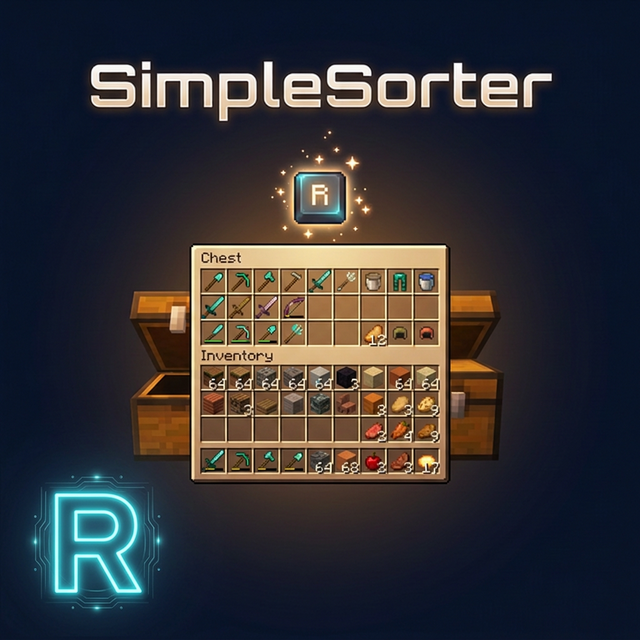

# SimpleSorter

> A lightweight client-side Fabric mod for effortless inventory management in Minecraft.

---

## ✨ Features

### 🔑 One-Key Smart Sorting

Open any container (inventory, chest, ender chest, etc.) and press **R** to instantly organize your items.

- **Auto Stack Merging** — Automatically consolidates partial stacks of the same item into full stacks, freeing up valuable slots
- **Category Sorting** — Items are arranged following the standard Creative Mode tab order:
  1. Tools & Utilities
  2. Combat
  3. Building Blocks
  4. Natural Blocks
  5. Functional Blocks
  6. Redstone
  7. Food & Drinks
  8. Ingredients
  9. Spawn Eggs
- **Pure Client-Side** — Sorting is performed by simulating player clicks, making it fully compatible with any server — no server-side installation required

---

### 🖱️ Mouse Tweaks

#### Shift + Drag to Quick-Move

Hold **Shift** and **left-click drag** across multiple slots — every slot you pass over will be instantly quick-moved to the opposite inventory.

> 💡 Much faster than Shift-clicking each slot one by one!

#### Shift + Double-Click to Move All Same Items

While **holding an item** on your cursor, **Shift + Double-Click** on a matching item to instantly quick-move **all identical items** from that inventory to the other side.

> 💡 Perfect for pulling all your diamonds or iron ingots out of a chest at once.

#### Space + Double-Click to Move Everything

Hold **Space** and **Double-Click** any slot in a container to instantly quick-move **every single item** from that inventory to the opposite side.

> 💡 One move to empty an entire chest — the ultimate moving day tool!

---

### 🔒 Slot Locking

Hold **Alt** and **click** any slot to **lock** it — locked slots display a red overlay.

- Locked slots are **never moved** when sorting with R
- Locked hotbar slots are **protected from Q-key drops** (prevents accidental discarding)
- Lock state is **automatically saved** and independent per save file
- **Alt + click** again to unlock

> 💡 Great for keeping your favourite tools exactly where you want them — safe from both sorting and accidental drops.

---

### 🔄 Auto Replacer

- **Tool Break Replacement** — When a held tool breaks, automatically equips a replacement of the same type from your inventory
- **Stackable Item Refill** — When a held stackable item runs out (e.g. placing blocks), automatically refills from your inventory
- Can be **toggled on/off** in the settings screen

> 💡 Never interrupt your building or mining flow to dig through your inventory for another pickaxe!

---

### 🗑️ Caps Lock + Double-Click to Batch Drop

Hold **Caps Lock** and **double-click** any slot to **drop all identical items** in that inventory (using the Q-key drop action).

> 💡 Quickly clear out large quantities of the same item without clicking one by one.

---

### ⚙️ In-Game Configuration

Press **Z + I** (default combo) to open a graphical settings panel in-game:

- **Category Sort Order** — Customize the priority of item categories
- **Z-Key Guard Toggle** — Disable the Z-key requirement to open settings with just I
- **Auto Replacer Toggle** — Enable/disable automatic tool and item replacement
- **Localized UI** — Settings interface automatically adapts to your game language (English / Chinese)

Also accessible from **Mod Menu** if installed.

---

## 📦 Requirements

| Dependency | Required? | Notes |
|---|---|---|
| **Fabric Loader** ≥ 0.16.5 | ✅ Required | Mod loader |
| **Fabric API** | ✅ Required | Core API library |
| **Fabric Language Kotlin** | ✅ Required | Kotlin runtime support |
| **Cloth Config API** | ❌ Bundled | Config screen framework (already included in the mod jar) |
| **Mod Menu** | ❌ Optional | Adds a settings entry in the mod list |

---

## 🚀 Installation

1. Install **Fabric Loader** and **Fabric API**
2. Download **Fabric Language Kotlin** and place it in your `mods` folder
3. Drop `simplesorter-fabric-x.x.x-3.0.0.jar` into your `mods` folder
4. Launch the game and enjoy!

---

## 🎮 Keybind Reference

| Key | Action | Context |
|:---:|---|---|
| **R** | Sort & organize inventory | While any container is open |
| **Alt + Click** | Lock / Unlock slot | Prevents that slot from being sorted |
| **Caps Lock + Double-Click** | Batch drop identical items | Quickly clear large stacks |
| **Shift + Drag** | Quick-move multiple slots | Drag across slots while holding Shift |
| **Shift + Double-Click** | Move all identical items | While holding an item on cursor |
| **Space + Double-Click** | Move all items from container | Empty an entire inventory at once |
| **Z + I** | Open settings screen | Available anytime |

---

## 📝 Technical Details

- **Client-Side Only** — No server modifications; sorting is achieved by simulating player click actions
- **Multi-Version Architecture** — Built with a `core` + `shared` + `platform` layered architecture, allowing one codebase to support multiple Minecraft versions
- **Modular Mouse Tweaks** — Each mouse enhancement is an independent `MouseTweakModule`, making it easy to add or modify features
- **License** — All Rights Reserved (See LICENSE file for strict usage terms)

---

  <b>Say goodbye to messy inventories.</b> 
  <i>SimpleSorter — Your Minecraft organization assistant.</i>

